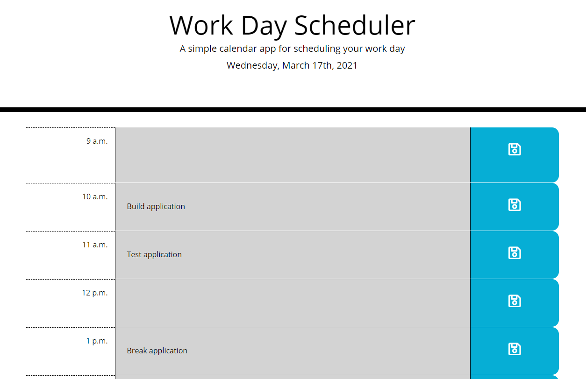

# Work Day Scheduler Application

## Project Overview
Work Day Scheduler 1.0 buildout. Developer created single-window application to display schedule for current work day with editable time blocks for scheduling tasks. Application leverages Bootstrap, jQuery and Moment.js to create responsive, dynamic layout that stores user inputs in local storage through event listeners added to save icons pulled from Font Awesome. Application dynamically updates statuses of time blocks (past, present, future) by running a setInterval call to check currentHour variable against actual hour pulled from Moment.js and then calling hourColorSetter() to check data-time attributes of textareas against currentHour. Interval also pulls date information displayed in header in case Work Day Scheduler is running at midnight local time.

Bootstrap enables inherently responsive layout for Work Day Scheduler with small CSS customizations to fine tune aesthetics and minimal media queries.

### Technologies Used:
<ul>
<li>jQuery</li>
<li>JavaScript</li>
<li>HTML</li>
<li>CSS</li>
</ul>

### External Libraries Used:
<ul>
<li><a href="https://jquery.com/" target="_blank">jQuery</a></li>
<li><a href="https://momentjs.com/" target="_blank">Moment.js</a></li>
<li><a href="https://getbootstrap.com/" target="_blank">Bootstrap</a></li>
<li><a href="https://fontawesome.com/" target="_blank">Font Awesome</a></li>
</ul>

## Live Application
https://captain63.github.io/homework5-work-day-scheduler/

## Screenshot

